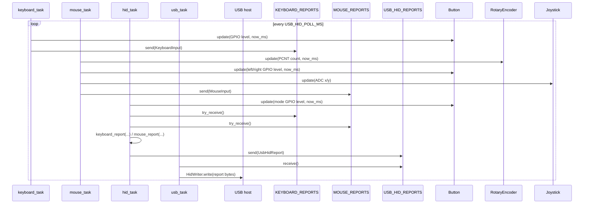
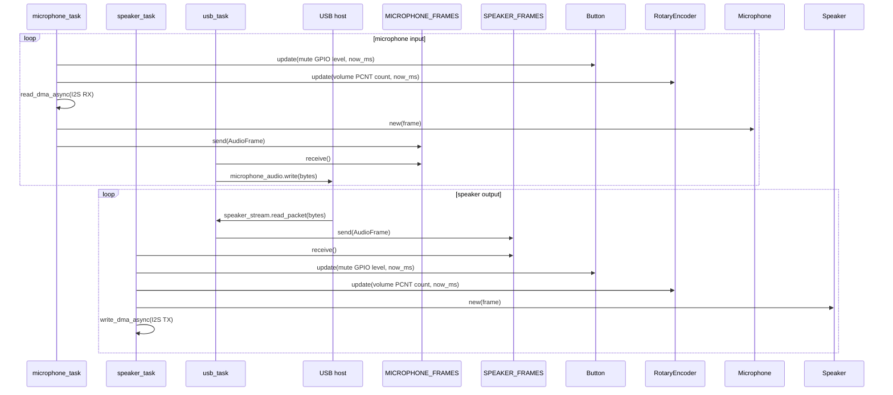

# DESIGN

## 基本方針

device struct は入力状態を表す immutable state として扱います。
task が peripheral を所有し、GPIO / ADC / PCNT / I2S から読んだ値で device struct を `update` します。
task 間の受け渡しは Embassy の `Channel` に限定します。

## Struct

| Struct | 役割 | 主な利用元 |
| --- | --- | --- |
| `Button` | debounce 済みの押下状態 | `hid_task`, `keyboard_task`, `mouse_task`, `microphone_task`, `speaker_task` |
| `RotaryEncoder` | PCNT count の安定化 | `mouse_task`, `microphone_task`, `speaker_task` |
| `Joystick` | ADC中心値からのX/Y差分 | `mouse_task` |
| `KeyboardInput` | キーボード系入力のsnapshot | `keyboard_task` → `hid_task` |
| `MouseInput` | マウス系入力のsnapshot | `mouse_task` → `hid_task` |
| `UsbHidReport` | USB HIDへ送るkeyboard/mouse report | `hid_task` → `usb_task` |
| `Microphone` | I2S RX frame | `microphone_task` |
| `Speaker` | USB speaker frame | `speaker_task` |

## Channel

| Channel | Payload | Producer | Consumer |
| --- | --- | --- | --- |
| `KEYBOARD_REPORTS` | `KeyboardInput` | `keyboard_task` | `hid_task` |
| `MOUSE_REPORTS` | `MouseInput` | `mouse_task` | `hid_task` |
| `USB_HID_REPORTS` | `UsbHidReport` | `hid_task` | `usb_task` |
| `MICROPHONE_FRAMES` | `AudioFrame` | `microphone_task` | `usb_task` |
| `SPEAKER_FRAMES` | `AudioFrame` | `usb_task` | `speaker_task` |

## HID sequence

`hid_task` が mouse mode / game mode の変換境界です。
`keyboard_task` と `mouse_task` は物理入力を snapshot にするだけで、USB report の最終形は `hid_task` で決めます。

## Audio sequence

Audio は `usb_task` を境界にして、microphone は device → host、speaker は host → device の向きで流れます。
