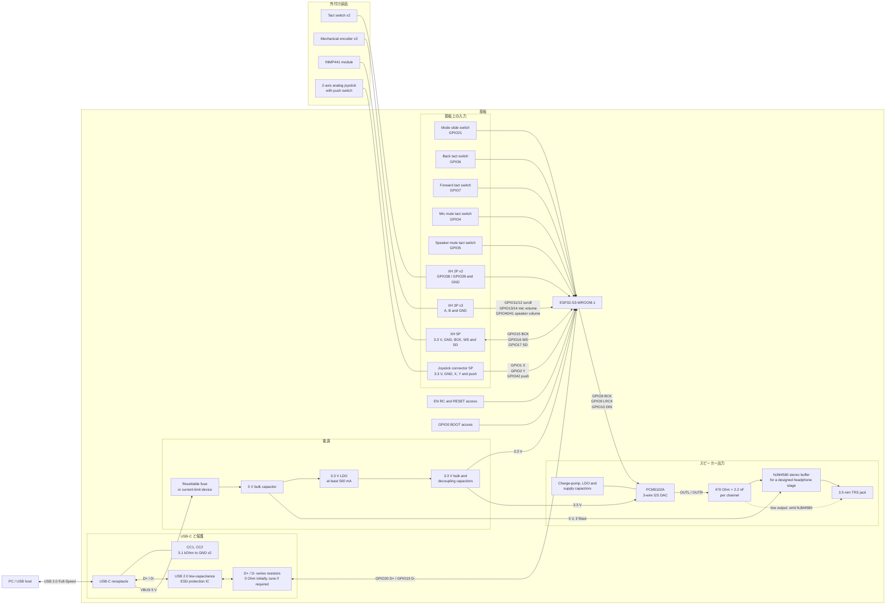

# 回路ブロック図

この図は、現行ファームウェアの GPIO 割り当てを基にした回路設計の入口である。

USB-C から給電するバスパワー機器、外付けの INMP441 モジュール、3.5 mm ステレオライン出力を前提とする。

## GPIO 対応表

| 機能 | GPIO | 接続先 |
| --- | --- | --- |
| USB D- / D+ | 19 / 20 | USB-C、ESD 保護 IC |
| ジョイスティック X / Y / push | 1 / 2 / 42 | 不足している外付けジョイスティック |
| 左 / 右クリック | 38 / 39 | XH 2P x2 |
| スクロールエンコーダー A / B | 11 / 12 | XH 3P |
| マイク音量エンコーダー A / B | 13 / 14 | XH 3P |
| スピーカー音量エンコーダー A / B | 40 / 41 | XH 3P |
| INMP441 BCLK / WS / SD | 15 / 16 / 17 | XH 5P |
| PCM5102A BCK / LRCK / DIN | 8 / 9 / 10 | 基板上 DAC |
| マイク mute / スピーカー mute | 4 / 5 | 基板上タクトスイッチ x2 |
| Back / Forward | 6 / 7 | 基板上タクトスイッチ x2 |
| モード切り替え | 21 | 基板上スライドスイッチ |

入力スイッチと機械式エンコーダーは、ファームウェアが有効にする内部プルアップを使い、接点を GND に落とす。

ケーブルが長い場合は、各入力に外付けプルアップ、RC フィルター、ESD 保護を追加する。

## 足りない部品と未確定事項

### 実装に必要な追加部品

- **2軸アナログジョイスティック x1 と 5P コネクタ x1**：現行ファームウェアは `GPIO1`、`GPIO2`、`GPIO42` を使うが、提示された部品表にはジョイスティックとコネクタがない。
- **USB-C の CC 抵抗 x2**：USB Power Delivery を使わない Sink として、CC1 と CC2 のそれぞれに 5.1 kΩ の `Rd` が必要になる。
- **書き込み用の BOOT と RESET 手段**：4個の基板上タクトスイッチは機能入力で使い切るため、GPIO0 と EN にタクトスイッチを2個追加するか、操作可能なテストパッドを設ける。
- **電源入口の保護**：リセッタブルヒューズまたは電流制限 IC を VBUS に入れる。
- **ESP32-S3 の EN 周辺**：EN を浮かせず、目安として 10 kΩ と 1 µF の RC を置く。
- **電源コンデンサ**：USB 入口と 3.3 V レールのバルクコンデンサ、各 IC の 0.1 µF デカップリング、LDO のデータシートが指定する入出力コンデンサが必要になる。
- **PCM5102A の周辺受動部品**：CAPP、CAPM、VNEG、LDOO、AVDD、DVDD、CPVDD のコンデンサと、左右出力の 470 Ω / 2.2 nF フィルターを TI の標準回路に合わせて実装する。
- **USB 配線用の部品定数**：USB ESD 保護 IC と LDO の具体的な型番を決める。
  D+ と D- の直列抵抗は 0 Ω で実装できるフットプリントを用意し、基板評価後に値を調整する。

### 仕様を決めてから選ぶ部品

- **3.5 mm 出力の負荷**：ライン入力を駆動するだけなら PCM5102A から直接出力でき、NJM4580 は不要である。
  ヘッドホンを駆動するなら、対象インピーダンスと必要音量を決めたうえで、NJM4580 の中点バイアス、結合コンデンサ、帰還抵抗、出力保護抵抗、電源デカップリングを設計する。
- **NJM4580 の電源**：動作電圧は 4 V 以上なので 3.3 V レールでは使えない。
  USB の 5 V を使う場合も、単電源バイアスと出力振幅を実機で確認する。
- **INMP441 の実装形態**：XH 5P は L/R 選択端子をマイク側で固定したモジュールに合う。
  裸の INMP441 を別基板へ載せる場合は、L/R の固定抵抗とマイク直近のデカップリングも必要になる。
- **PCM5102A の左右チャンネル**：現行ファームウェアの USB スピーカーと I2S TX は mono 設定である。
  左右両方から同じ音を出すなら、I2S の左右スロットへ複製されることを実機またはロジックアナライザーで確認し、必要ならファームウェアを stereo 送信へ変更する。
- **ESP32-S3-WROOM-1 の枝番**：Flash と PSRAM の容量および電圧を確定し、使用 GPIO と競合しないモジュールを選ぶ。
  `GPIO39` から `GPIO42` は既定 JTAG と重なるため、この配線では外部 JTAG を同時使用できない。

## 回路図へ進むときの基準資料

- [ESP32-S3-WROOM-1 データシート](https://www.espressif.com/sites/default/files/documentation/esp32-s3-wroom-1_wroom-1u_datasheet_en.pdf)
- [ESP32-S3 Hardware Design Guidelines](https://documentation.espressif.com/esp-hardware-design-guidelines/en/latest/esp32s3/index.html)
- [PCM5102A データシート](https://www.ti.com/lit/ds/symlink/pcm5102a.pdf)
- [NJM4580 製品仕様](https://www.nisshinbo-microdevices.co.jp/ja/products/operational-amplifier/spec/?product=njm4580)
- [INMP441 データシート](https://invensense.tdk.com/wp-content/uploads/2015/02/INMP441.pdf)

この文書は接続関係を示すブロック図であり、製造用回路図ではない。

部品の型番を確定した後、各データシートの標準回路、定格、レイアウト条件を反映した回路図と ERC を別途作成する。
