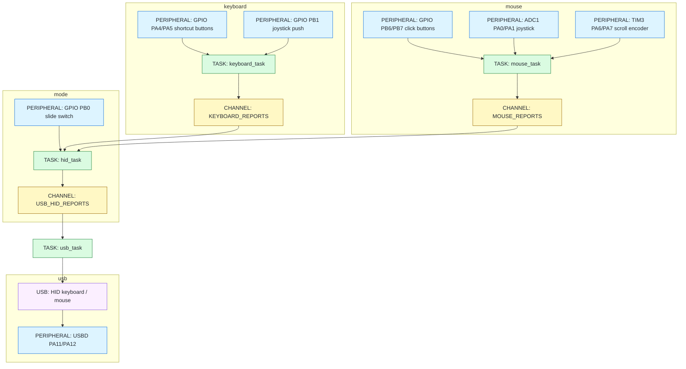

# dxxk_mouse

CH32V203K8T6 上で動作する Rust 製 USB 入力デバイスです。

ファームウェアは、USB HID のキーボードとマウスを一つの USB デバイスとして提供します。

USB Audio と I2S を使うマイクおよびスピーカーは対象外です。

> [!NOTE]
> この README は CH32V203K8T6 への移植後の構成を示します。
> ソースコードとビルド設定の移植は完了していません。

## 対象環境

| 項目 | 構成 |
| --- | --- |
| MCU | CH32V203K8T6（LQFP32） |
| CPU | QingKe V4B（RISC-V） |
| Flash | 64 KiB |
| RAM | 20 KiB |
| Rust target | `riscv32imc-unknown-none-elf` |
| HAL | `ch32-hal`（`ch32v203k8t6` feature） |
| async runtime | Embassy、`qingke-rt` |
| USB | `embassy-usb`、`ch32-hal::usbd` |
| 書き込み | `wlink`、WCH-Link |

## ディレクトリ構成

```text
dick_mouse
├── Cargo.toml
├── .cargo/config.toml
├── src
│   ├── main.rs
│   ├── lib.rs
│   ├── device
│   │   ├── button.rs
│   │   ├── encoder.rs
│   │   └── joystick.rs
│   └── tasks
│       ├── hid.rs
│       ├── keyboard.rs
│       ├── mouse.rs
│       └── usb.rs
└── tests
    ├── device
    │   ├── button.rs
    │   ├── encoder.rs
    │   └── joystick.rs
    ├── main.rs
    ├── reexports.rs
    └── tasks
        └── mod.rs
```

## 設計図



## 実装概要

### デバイス状態

| 型 | 入力 | 責務 |
| --- | --- | --- |
| `Button` | GPIO level、時刻 | active level、debounce、押下状態を保持する |
| `RotaryEncoder` | TIM3 count、時刻 | count を安定化し、detent 算出に使う値を保持する |
| `Joystick` | X/Y の ADC 値 | 初期位置を中心として X/Y の差分を計算する |

各構造体は setter や `&mut self` を持たず、`update(self) -> Self` で新しい状態を返します。

### task のデータフロー

| task | 入力 | 処理 | 出力 |
| --- | --- | --- | --- |
| `keyboard_task` | joystick push、Back、Forward の GPIO | `Button` を更新し、ボタン状態を集約する | `KEYBOARD_REPORTS` |
| `mouse_task` | click の GPIO、joystick の ADC、encoder の TIM3 count | `Button`、`Joystick`、`RotaryEncoder` を更新し、マウス入力を集約する | `MOUSE_REPORTS` |
| `hid_task` | mode GPIO、`KEYBOARD_REPORTS`、`MOUSE_REPORTS` | mode に応じて入力を keyboard または mouse report に変換する | `USB_HID_REPORTS` |
| `usb_task` | `USB_HID_REPORTS` | report ID を付けて HID endpoint へ書き込む | USB HID keyboard、mouse |

## 入力割り当て

`PB0` のスライドスイッチに応じて、`hid_task` が通常モードとゲームモードを切り替えます。

| 入力 | 通常モード | ゲームモード |
| --- | --- | --- |
| joystick X/Y | Mouse X/Y | Arrow keys |
| joystick push | PrintScreen | S |
| left click | Mouse left button | A |
| right click | Mouse right button | D |
| Back button | Ctrl+Left | Space |
| Forward button | Ctrl+Right | Enter |
| scroll encoder | Mouse wheel | 使用しない |

ゲームモードでは joystick の X/Y 差分が `512` を超えた方向をキー入力へ変換します。

同時押しが HID keyboard の上限を超えた場合は、割り当て順で先頭の 6 キーを送信します。

## USB インターフェース

| インターフェース | USB class | 方向 | データ形式 |
| --- | --- | --- | --- |
| Keyboard | HID、report ID `1` | CH32V203K8T6 から PC | modifier、6 keycodes |
| Mouse | HID、report ID `2` | CH32V203K8T6 から PC | buttons、X/Y、wheel、pan |

## ピン割り当て

| 機能 | 信号 | peripheral | 端子 | 所有する task |
| --- | --- | --- | --- | --- |
| Mode | slide switch | GPIO | `PB0` | `hid_task` |
| Keyboard | joystick push | GPIO | `PB1` | `keyboard_task` |
| Keyboard | Back button | GPIO | `PA4` | `keyboard_task` |
| Keyboard | Forward button | GPIO | `PA5` | `keyboard_task` |
| Mouse | joystick X | ADC1 IN0 | `PA0` | `mouse_task` |
| Mouse | joystick Y | ADC1 IN1 | `PA1` | `mouse_task` |
| Mouse | scroll encoder A | TIM3 CH1 | `PA6` | `mouse_task` |
| Mouse | scroll encoder B | TIM3 CH2 | `PA7` | `mouse_task` |
| Mouse | left click | GPIO | `PB6` | `mouse_task` |
| Mouse | right click | GPIO | `PB7` | `mouse_task` |
| USB | D- | USBD DM | `PA11` | `usb_task` |
| USB | D+ | USBD DP | `PA12` | `usb_task` |

`PA11` と `PA12` は USBD に使用するため、汎用入出力には割り当てません。

`PA13` と `PA14` は WCH-Link のデバッグ端子として確保します。

## ビルドと書き込み

Rust target と書き込みツールをインストールします。

```sh
rustup target add riscv32imc-unknown-none-elf
cargo install wlink
```

ファームウェアをビルドし、WCH-Link から書き込みます。

```sh
cd dick_mouse
cargo check
cargo run --release
```

通常実行時の runner には、`.cargo/config.toml` で `wlink -v flash` を指定します。

## テスト

| test target | 検証対象 |
| --- | --- |
| `button` | debounce と押下状態 |
| `encoder` | count の安定化 |
| `joystick` | 中心位置からの X/Y 差分 |
| `reexports` | `device` 型の公開 API |
| `tasks` | HID report 変換と task の入口 |
| `main` | firmware で使う peripheral の初期化 |

CH32V203K8T6 の実機テスト用 runner は、ソースコードの移植時に設定します。

## 制約

- `ch32-hal` は開発中であり、USB の動作は実機で確認する必要があります。
- ROM と RAM の分割設定は、リンカースクリプトが前提とする構成に合わせます。
- USB Audio、I2S、マイク、スピーカーには対応しません。
