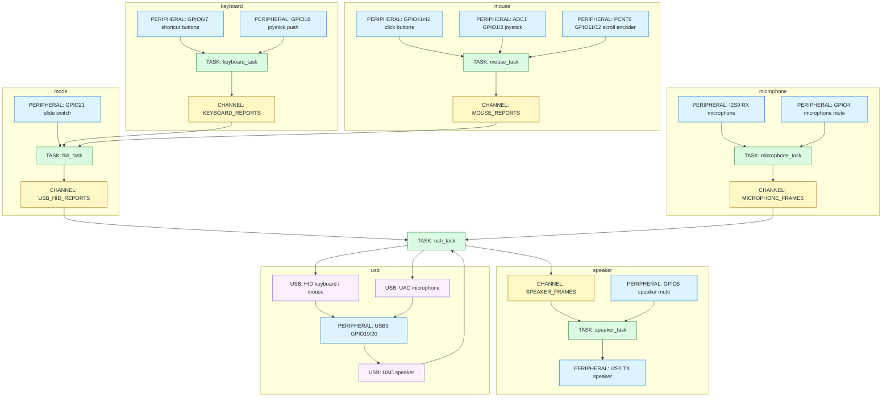

# dxxk_mouse

ESP32-S3 上で動作する Rust 製 USB 入力デバイスの実験用リポジトリです。

ファームウェアは、USB HID のキーボードとマウス、USB Audio Class 1（UAC1）のマイクとスピーカーを一つの USB デバイスとして提供します。

## 対象環境

| 項目 | 構成 |
| --- | --- |
| MCU | ESP32-S3 |
| Rust target | `xtensa-esp32s3-none-elf` |
| HAL | `esp-hal` |
| async runtime | Embassy、`esp-rtos` |
| USB | `embassy-usb` |
| 実機テスト | `embedded-test`、`probe-rs` |

## ディレクトリ構成

```text
dick_mouse
├── Cargo.toml
├── .cargo/config.toml
├── src
│   ├── main.rs
│   ├── lib.rs
│   ├── device
│   │   ├── button.rs
│   │   ├── encoder.rs
│   │   ├── joystick.rs
│   │   ├── microphone.rs
│   │   └── speaker.rs
│   └── tasks
│       ├── audio.rs
│       ├── hid.rs
│       ├── keyboard.rs
│       ├── mouse.rs
│       └── usb.rs
└── tests
    ├── device
    │   ├── button.rs
    │   ├── encoder.rs
    │   ├── joystick.rs
    │   ├── microphone.rs
    │   └── speaker.rs
    ├── main.rs
    ├── reexports.rs
    └── tasks
        └── mod.rs
```

## 設計図



## 実装概要

### デバイス状態

| 型 | 入力 | 責務 |
| --- | --- | --- |
| `Button` | GPIO level、時刻 | active level、debounce、押下状態を保持する |
| `RotaryEncoder` | PCNT count、時刻 | count を安定化し、detent 算出に使う値を保持する |
| `Joystick` | X/Y の ADC 値 | 初期位置を中心として X/Y の差分を計算する |
| `Microphone` | I2S RX frame | USB マイクへ送る音声フレームを保持する |
| `Speaker` | USB speaker frame | I2S TX へ送る音声フレームを保持する |

各構造体は setter や `&mut self` を持たず、`update(self) -> Self` または `new()` で新しい状態を返します。

### task のデータフロー

USB HID と USB Audio は、同じ列で入力、処理、出力を示します。

#### USB HID

| task | 入力 | 処理 | 出力 |
| --- | --- | --- | --- |
| `keyboard_task` | joystick push、Back、Forward の GPIO | `Button` を更新し、ボタン状態を集約する | `KEYBOARD_REPORTS` |
| `mouse_task` | click の GPIO、joystick の ADC、encoder の PCNT | `Button`、`Joystick`、`RotaryEncoder` を更新し、マウス入力を集約する | `MOUSE_REPORTS` |
| `hid_task` | mode GPIO、`KEYBOARD_REPORTS`、`MOUSE_REPORTS` | mode に応じて入力を keyboard または mouse report に変換する | `USB_HID_REPORTS` |
| `usb_task` | `USB_HID_REPORTS` | report ID を付けて HID endpoint へ書き込む | USB HID keyboard、mouse |

#### USB Audio

| task | 入力 | 処理 | 出力 |
| --- | --- | --- | --- |
| `microphone_task` | I2S RX、mute GPIO | mute 状態を反映し、PCM byte 列を音声フレームへ変換する | `MICROPHONE_FRAMES` |
| `usb_task`（microphone） | `MICROPHONE_FRAMES` | mono sample を左右へ複製し、UAC1 packet を組み立てる | USB UAC1 microphone |
| `usb_task`（speaker） | USB UAC1 speaker | UAC1 packet を音声フレームへ変換する | `SPEAKER_FRAMES` |
| `speaker_task` | `SPEAKER_FRAMES`、mute GPIO | mute 状態を反映し、音声フレームを PCM byte 列へ変換する | I2S TX |

## 入力割り当て

`GPIO21` のスライドスイッチに応じて、`hid_task` が通常モードとゲームモードを切り替えます。

| 入力 | 通常モード | ゲームモード |
| --- | --- | --- |
| joystick X/Y | Mouse X/Y | Arrow keys |
| joystick push | PrintScreen | S |
| left click | Mouse left button | A |
| right click | Mouse right button | D |
| Back button | Ctrl+Left | Space |
| Forward button | Ctrl+Right | Enter |
| scroll encoder | Mouse wheel | 使用しない |

ゲームモードでは joystick の X/Y 差分が `512` を超えた方向をキー入力へ変換します。

同時押しが HID keyboard の上限を超えた場合は、実装上の割り当て順で先頭の 6 キーを送信します。

## USB インターフェース

| インターフェース | USB class | 方向 | データ形式 |
| --- | --- | --- | --- |
| Keyboard | HID、report ID `1` | ESP32-S3 から PC | modifier、6 keycodes |
| Mouse | HID、report ID `2` | ESP32-S3 から PC | buttons、X/Y、wheel、pan |
| Microphone | UAC1 source | ESP32-S3 から PC | 48 kHz、16-bit、stereo |
| Speaker | UAC1 speaker | PC から ESP32-S3 | 48 kHz、16-bit、mono（Left Front） |

I2S は RX、TX ともに 48 kHz、16-bit、mono で動作します。

USB microphone には、I2S RX の mono sample を左右の channel へ複製して送信します。

## ピン割り当て

| 機能 | 信号 | peripheral | GPIO | 所有する task |
| --- | --- | --- | --- | --- |
| Mode | slide switch | GPIO | `GPIO21` | `hid_task` |
| Keyboard | joystick push | GPIO | `GPIO18` | `keyboard_task` |
| Keyboard | Back button | GPIO | `GPIO6` | `keyboard_task` |
| Keyboard | Forward button | GPIO | `GPIO7` | `keyboard_task` |
| Mouse | joystick X | ADC1 | `GPIO1` | `mouse_task` |
| Mouse | joystick Y | ADC1 | `GPIO2` | `mouse_task` |
| Mouse | scroll encoder A | PCNT0 | `GPIO11` | `mouse_task` |
| Mouse | scroll encoder B | PCNT0 | `GPIO12` | `mouse_task` |
| Mouse | left click | GPIO | `GPIO42` | `mouse_task` |
| Mouse | right click | GPIO | `GPIO41` | `mouse_task` |
| Microphone | mute button | GPIO | `GPIO4` | `microphone_task` |
| Microphone | BCLK | I2S0 RX | `GPIO15` | `microphone_task` |
| Microphone | WS | I2S0 RX | `GPIO16` | `microphone_task` |
| Microphone | DIN | I2S0 RX | `GPIO17` | `microphone_task` |
| Speaker | mute button | GPIO | `GPIO5` | `speaker_task` |
| Speaker | BCLK | I2S0 TX | `GPIO8` | `speaker_task` |
| Speaker | WS | I2S0 TX | `GPIO9` | `speaker_task` |
| Speaker | DOUT | I2S0 TX | `GPIO10` | `speaker_task` |
| USB | D- | USB0 | `GPIO19` | `usb_task` |
| USB | D+ | USB0 | `GPIO20` | `usb_task` |

I2S RX と I2S TX は `I2S0` と `DMA_CH0` を共有します。

`GPIO0/3/45/46` は strapping、`GPIO43/44` は UART0、`GPIO19/20` は USB に使われるため、汎用入力には割り当てていません。

`GPIO41/42` は外部 JTAG の既定信号と重なるため、現在の click button 配線と外部 JTAG は同時に使用できません。

## ビルドと書き込み

```sh
cd dick_mouse
cargo check
cargo run --release
```

通常実行時の runner は `.cargo/config.toml` に定義した `espflash flash` です。

## 実機テスト

テストはホスト PC 上の unit test ではなく、ESP32-S3 実機上で動作する `embedded-test` 形式です。

```sh
cargo test-hil
```

`cargo test-hil` は `.cargo/config.toml` の alias で、runner を `probe-rs run --chip esp32s3` に上書きします。

| test target | 検証対象 |
| --- | --- |
| `button` | debounce と押下状態 |
| `encoder` | count の安定化 |
| `joystick` | 中心位置からの X/Y 差分 |
| `microphone` | microphone frame の状態型 |
| `speaker` | speaker frame の状態型 |
| `reexports` | `device` 型の公開 API |
| `tasks` | PCM 変換、HID report 変換、task の入口 |
| `main` | firmware で使う peripheral の初期化 |

`tests/` 配下の各ファイルは `Cargo.toml` の `[[test]]` で明示し、ESP32-S3 上の結合テストとして実行します。

## 制約

- ビルドには `xtensa-esp32s3-none-elf` target に対応した Rust 環境が必要です。
- 実機テストには `probe-rs` がデバイスへアクセスできる権限が必要です。
- `embassy-usb` は UAC1 source を使うため、Embassy の git revision に固定しています。
