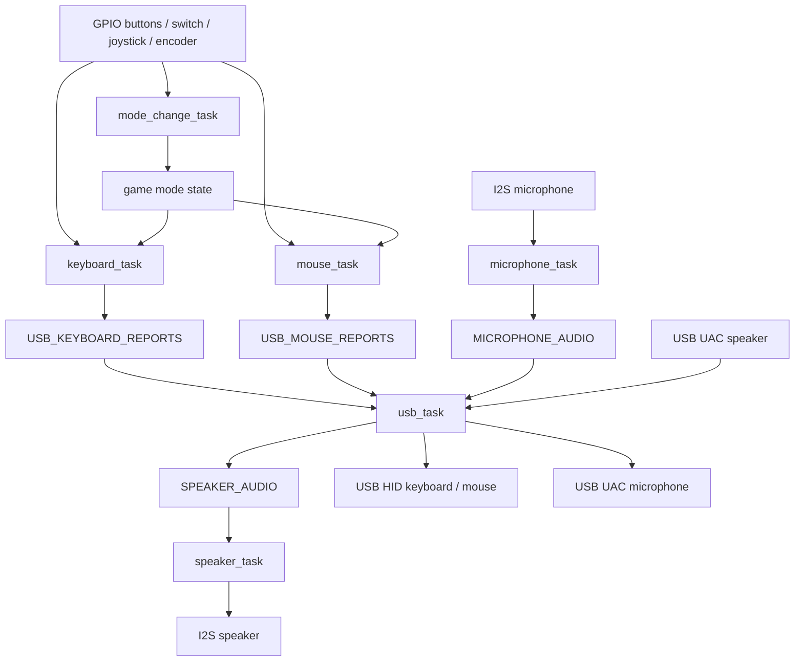

# dxxk_mouse

ESP32-S3 上で動作する Rust 製の USB 入力デバイス実験用リポジトリです。

`esp-hal`、`esp-rtos`、Embassy を使い、マウス、キーボード、USB Audio の入出力を 1 つの USB device として扱います。

## 対象環境

- MCU: ESP32-S3
- Rust target: `xtensa-esp32s3-none-elf`
- HAL: `esp-hal`
- async runtime: Embassy / `esp-rtos`
- USB: `embassy-usb`
- 実機テスト: `embedded-test` + `probe-rs`

## 構成

```text
dick_mouse
├── Cargo.toml
├── .cargo/config.toml
├── src
│   ├── main.rs
│   ├── lib.rs
│   ├── device
│   │   ├── button.rs
│   │   ├── encoder.rs
│   │   ├── joystick.rs
│   │   ├── microphone.rs
│   │   └── speaker.rs
│   └── tasks
│       ├── game.rs
│       ├── keyboard.rs
│       ├── microphone.rs
│       ├── mode_change.rs
│       ├── mouse.rs
│       ├── speaker.rs
│       └── usb.rs
└── tests
    ├── device
    │   ├── button.rs
    │   ├── encoder.rs
    │   ├── joystick.rs
    │   ├── microphone.rs
    │   └── speaker.rs
    ├── main.rs
    └── reexports.rs
```

## 設計図



## 実装概要

### デバイス状態

- `Button`: active level、debounce、押下状態を保持するイミュータブルな状態型
- `RotaryEncoder`: PCNT count の安定化と detent 変換を扱う状態型
- `Joystick`: ADC の中心値から X/Y 差分を計算する状態型
- `Microphone`: I2S RX から受けた音声 frame を保持する状態型
- `Speaker`: USB speaker から受けた音声 frame を保持する状態型

GPIO や ADC/PCNT/I2S peripheral は task 側が所有し、device 構造体は状態だけを持ちます。

### USB HID

`usb_task` で USB device、keyboard HID、mouse HID、USB Audio をまとめて構築します。

| task | 入力 | 出力 |
| --- | --- | --- |
| `mouse_task` | `GPIO13/14` buttons, `GPIO1/2` joystick, `PCNT0 GPIO11/12` scroll encoder | `USB_MOUSE_REPORTS` |
| `keyboard_task` | `GPIO18` joystick push, `GPIO6/7` shortcut buttons | `USB_KEYBOARD_REPORTS` |
| `mode_change_task` | `GPIO21` slide switch | game mode flag |
| `game` | game mode state/key report helper | `USB_KEYBOARD_REPORTS` |
| `usb_task` | HID report channel | USB HID keyboard/mouse |

キーボードボタンは以下です。

| GPIO | action |
| --- | --- |
| `GPIO18` | Screenshot |
| `GPIO6` | Back |
| `GPIO7` | Forward |

ゲームモード中は通常の keyboard/mouse report を止め、以下のキー入力に切り替えます。

| input | game key |
| --- | --- |
| joystick | Arrow keys |
| joystick push | S |
| left click | A |
| right click | D |
| Back button | Space |
| Forward button | Enter |

### USB Audio / I2S

| task | 用途 | GPIO / peripheral |
| --- | --- | --- |
| `microphone_task` | I2S RX から音声を読み、USB microphone 側へ送る。`GPIO4` でmute toggle | `I2S0`, `DMA_CH0`, `GPIO15` BCLK, `GPIO16` WS, `GPIO17` DIN |
| `speaker_task` | USB speaker 側から受けた音声を I2S TX へ出す。`GPIO5` でmute toggle | `I2S0`, `DMA_CH0`, `GPIO8` BCLK, `GPIO9` WS, `GPIO10` DOUT |
| `usb_task` | UAC1 microphone/source と speaker を動かす | `USB0`, `GPIO20`, `GPIO19` |

USB audio は 48 kHz / 16-bit mono を前提にしています。

GPIO は `GPIO0/3/45/46` のstrapping、`GPIO39-42` のJTAG、`GPIO43/44` のUART0、`GPIO19/20` のUSB D-/D+との干渉を避ける前提で割り当てています。

## ビルドと実行

```sh
cd dick_mouse
cargo check
cargo run --release
```

通常実行時の runner は `.cargo/config.toml` の `espflash flash --monitor` です。

## 実機テスト

このリポジトリのテストはホストPC上の通常unit testではなく、ESP32-S3実機上で動かす `embedded-test` 形式です。

```sh
cargo test-hil
```

`cargo test-hil` は `.cargo/config.toml` の alias で、runner を `probe-rs run --chip esp32s3` に上書きします。

現在の test target:

- `button`
- `encoder`
- `joystick`
- `microphone`
- `speaker`
- `reexports`
- `main`

`tests/` 配下の各ファイルは `Cargo.toml` の `[[test]]` で明示し、ESP32-S3上の結合テストとして実行します。

## 注意

- `xtensa-esp32s3-none-elf` 向けにビルドできる Rust 環境が必要です。
- `probe-rs` で USB-JTAG にアクセスできる権限が必要です。
- `embassy-usb` は UAC1 source を使うため Embassy git revision に固定しています。
